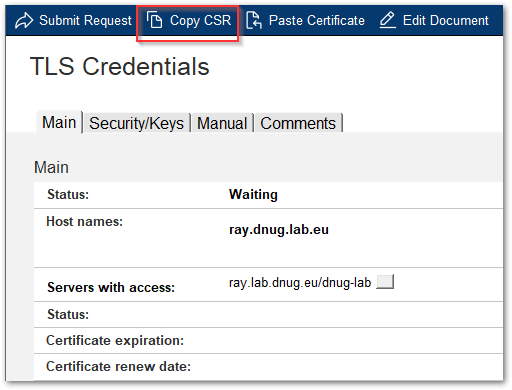
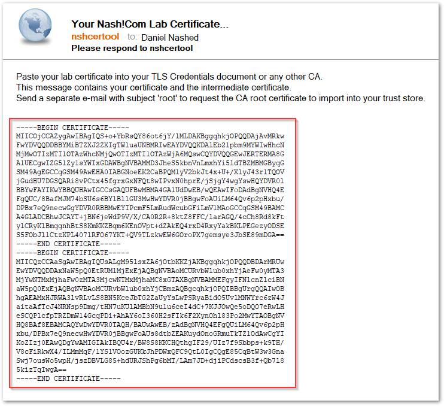

# CertMgr Manual Flow

The Manual Flow replaces the old **OpenSSL** and **kyrtool** operations:

- Create RSA or ECDSA key
- Create CSR (Certificate Signing Request)
- Import certificate, chain and root certificates

This flow allows to request and import certificates from external or corporate CAs.  
Creating the private key directly is the recommended way to ensure private keys are always safely stored.

## Create a new TLS Credentials document

Switch to the TLS Credentials view and use the action menu to create a new TLS credentials document.

## Specify CSR details

Today's web server certificates require a so called "SAN" (Subject Alternate Name) even for a single server host name.

- Specify the DNS server entry in the host name field first.
- Select one or more servers which should be able to use this new TLS credentials.
- Specify the key format and key size/key curve

## Create new CSR and send it to CA

Submitting the document requests a new CSR for the newly created key.

Once the server processed the request the menu shows a new button to copy the CSR to be send to your corporate or external CA.

In our example case we are sending the CSR by mail to a lab certificate authority (CA).

## Root CA Certificate

In most cases the CA is not provide the root certificate and in many cases not even the intermediate certificates along with the new certificate.
In this case first import the trusted root certificate or append the root certificate in PEM format to your received certificate.
Note: Refer to the separate howto document for trusted root import (todo).

## Import Leaf Certificate and Chain

Production certificate requests might take up to a couple of days.
In our example case the Lab CA sends back the signed certificate and CA chain immediately back to the sender.

The required format is the text based PEM format. In case your certificate chain is not in PEM format, convert the format accordingly.
Most external and internal CAs provide the CA in PEM format if requested.

Use the past button to past the certificate chain into the TLS Credentials document and submit the request.
The CertMgr server merges your certificates with the private key and checks if the certificate chain is complete.

After the request is processed reopen the document and check the status of the certificate.

